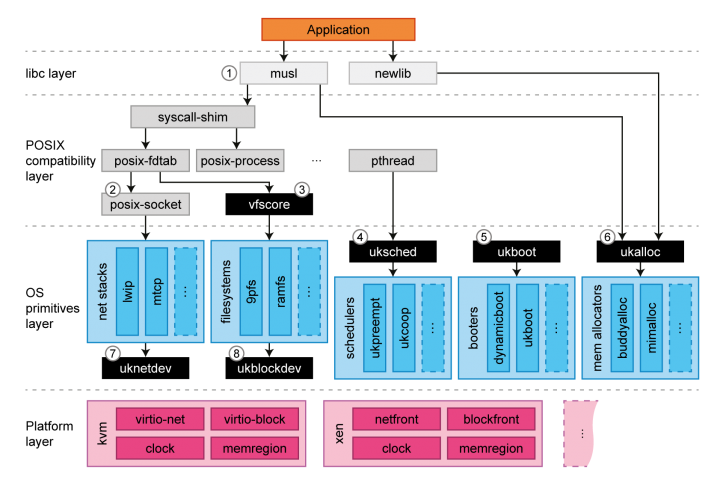
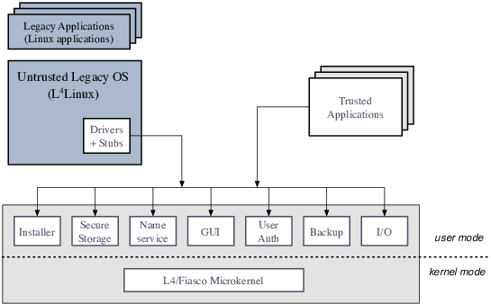
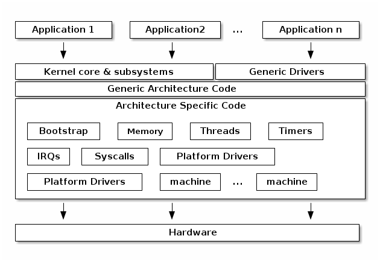
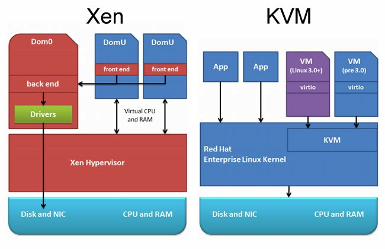

---

## Types of Operating Systems

---

### Use Cases

- Provide thin layer on top of hardware (generally embedded)
- Allow multitasking
- Allow isolated multitasking
- Multiple OSes on the same hardware (hypervisors)
- Fast & transient runs (micro VMs, function-as-a-service - FaaS)
- Large CPU / I/O / memory loads
- High-Performance Computing (HPC)
- Time constraints

----

### Requirements

- A system call API is generally provided
- Multiprocessing / multithreading / scheduling: yes / no
- Resource isolation between applications: yes / no
  - Domain separation (privileged vs unprivileged)
- Hardware mode for hypervisors: yes / no
- Real-time features

---

### OS Types

- Embedded OSes
- Single Address Space OSes
- Microkernels
- Monolithic Kernels
- Hypervisors

----

### Embedded OSes

- Typically run on small devices
  - low-power, low-memory
- Often does not require domain separation
- OS closer to a library
- Typically provide real-time features

----

### Single Address Space OSes

- The OS and application linked together
- Typically run in the same domain: no need for domain transitions
- Library OS + application code linked together
- Unikernels
- Can be run as VMs

----

### Unikraft

<!-- https://www.usenix.org/publications/loginonline/unikraft-and-coming-age-unikernels -->

----

### Microkernels

- Small kernel (small TCB)
- Components run as user space processes (scheduler, file system, network stack)
- Increased security, increased overhead

----

### The L4 Microkernel

<!-- https://www.researchgate.net/figure/Nizza-Security-Architecture-The-picture-illustrates-the-overall-architecture-of-Nizza_fig1_233765184 -->

----

### Monolithic Kernels

- All components run in kernel mode
- Typical architecture of modern desktop / server systems
- Extensible via loadable kernel-modules
- Larger TCB when compared to microkernel
- Increased performance (all in one place)

----

### The Linux Kernel

<!-- https://linux-kernel-labs.github.io/refs/heads/master/lectures/arch.html -->

----

### Hypervisors

- Thin layer on top of hardware
- Host OSes inside virtual machines
- Typically require hardware features (e.g. Intel VT-x)

----

### Xen and KVM

<!-- https://medium.com/@saisarathchandrap/virtualisation-at-alibaba-cloud-b20dea72efa1 -->
