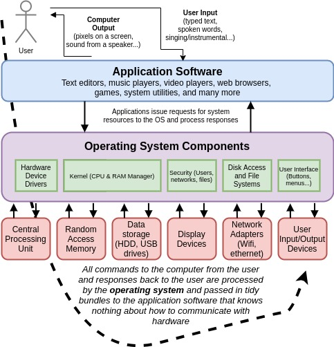
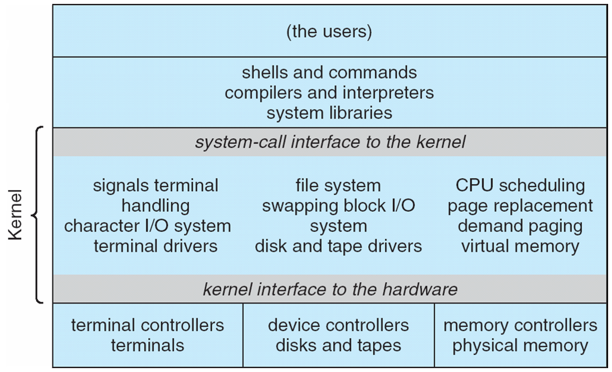
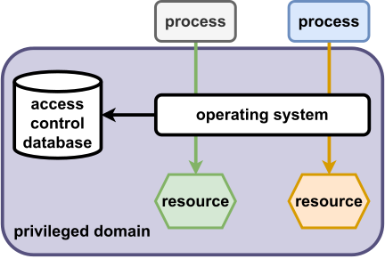
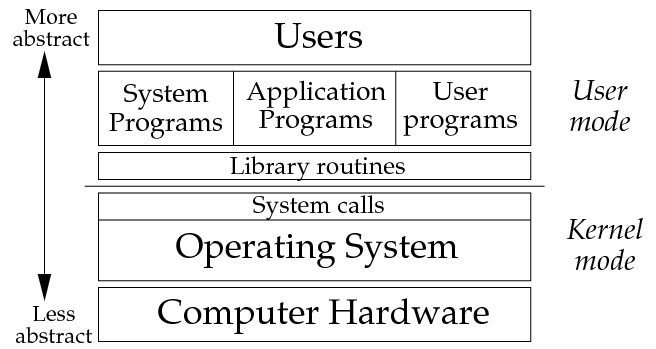

---

## Operating Systems

---

### Need for Operating System (OS)

- Hardware portability
  - Use different I/O devices (drivers)
  - Run on different architectures
- Core system features
  - Memory management
  - Scheduling for multiple applications / processes
  - File system implementation
  - Networking stack

----

### OS Roles

- Hardware abstraction
- System services
- Isolation between processes
- Resource protection (memory, devices)

---

### OS: Library-like Component

<!-- https://technologyrediscovery.net/compFund/obcat.comp.os.html -->

----

### System Call Interface

<!-- https://cse.buffalo.edu/~bina/cse321/fall2017/Lectures/Sept6System.html -->

----

### System Calls

- API for the operating system
- Also called **system services**
- Similar to library calls
- Transfer control to the operating system code
- Typically standard
- System call IDs with system call handlers
  - Linux: `/usr/include/x86_64-linux-gnu/asm/unistd_64.h`

----

### OS Perspective

- Also called **kernel**
- A software component that doesn't do work by itself
- It serves applications, by providing an API - system (call) API
- When a process invokes a kernel feature we say _the kernel runs on behalf of the process_

---

### Privilege Domains

- typically, there are multiple applications / processes
- requirement for isolation
- provider of isolation must be protected / privileged
- privileged vs unprivileged actions

----

### OS in Privileged Domain

Security role: _Reference Monitor_

----

### User Mode, Kernel Mode

----

### User Mode vs Kernel Mode

| User Mode                        | Kernel Mode                                |
| :------------------------------: | :----------------------------------------: |
| application code                 | kernel code                                |
| unprivileged                     | privileged                                 |
| may fault                        | critical                                   |
| applications / processes         | kernel, drivers                            |
| flexible, diverse                | specific, standard                         |

----

### Privileged vs Unprivileged Actions

#### Unprivileged

- memory access (read, write)
- logical and arithmetic operations
- function calls

#### Privileged

- I/O resource access (files, network, terminal, time)
- memory allocation
- inter-app communication

----

### TCB: Trusted Computing Base

- The critical part of the system (regarding security)
- Bugs in TCB jeopardize the whole system
- Kernel, drivers, system services, system database, hardware, firmware
- Hardware, hypervisor, control domain for virtualized environments

---

### System Calls

- Calls from application to kernel
- Typically transfer control from user mode to kernel mode
- Cause overhead (mode transfer)

----

### Kernel Code

- Runs when system calls are made (application invocation) ...
- ... or when interrupts are delivered (device actions)
- It is not a process or an entity
- It is a library (software component) that runs in privileged mode when invoked
  - by applications - via system calls
  - by I/O devices - via interrupts

----

### Implementing Kernel Mode

Also called **supervisor mode**

----

### Standard C Library

----

### C APIs

- ANSI / ISO
  - standard API, portable across OSes
  - <https://www.iso-9899.info/wiki/The_Standard>
- POSIX
  - standard for UNIX-based OSes: Linux, \*BSD, macOS
  - Windows has a POSIX API
  - <https://pubs.opengroup.org/onlinepubs/9699919799>
- Windows API
  - formerly Win32 API
  - <https://learn.microsoft.com/en-us/windows/win32/apiindex/windows-api-list>

----

### Library Calls vs System Calls

| Library calls                     | System calls                               |
| :-------------------------------: | :----------------------------------------: |
| provided by libraries             | provided by operating system               |
| flexible, diverse                 | specific, standard                         |
| typical function calls            | typically cause mode switch                |
| use standard C calling convention | custom OS calling convention               |
| generally portable                | OS-specific                                |
