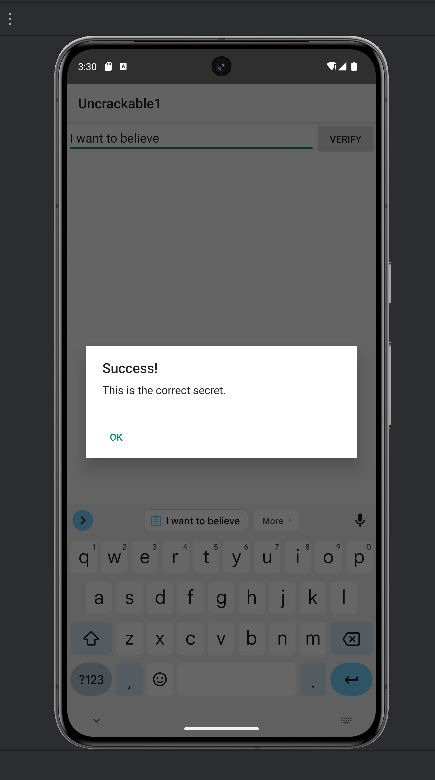

# Android Analysis and Patching

In this lab, we will analyze the code of an Android app in order to modify and recompile it.
We use a simple app that will be modified to allow the use to pass a few connditions.
The app can be downloaded from [here](https://github.com/OWASP/owasp-mastg/tree/master/Crackmes/Android/Level_01).

**Please use an emulator to run the malware during this lab and don't install it on your physical Android device.**

## Running the app

The first step is to open Android Studio and run the app on the emulator.
You can use either the Android Studio emulator from the previous labs or you can install [GenyMotion](https://www.genymotion.com/product-desktop/download/).

Once you have a running emulator, you can run the `UnCrackable-Level1.apk`.
- For Android Studio, drag and drop the apk file in the emulator.
- For GenyMotion, you can install the `apk` using `adb`:
  
```bash
$  adb install UnCrackable-Level1.apk 
```

Now, a new app called **Uncrackable1** should be available in your applications list.
<p align="center">

</p>

The app is simple and asks for a secret string that isn't known.
We start by using static analysis and we need MobSF that runs with the command:

```bash
$ sudo docker run -it --rm -p 8000:8000 opensecurity/mobile-security-framework-mobsf:latest
```

Open the MobSF menu from [here](http://localhost:8000/).

To start, press on the button for upload and select the .apk file. Results are displayed on the browser.
For our current task we need to check the source code. On the Decompiled Code section, press View Source button and we can inspect the code.
We can navigate to the MainActivity.class and notice that there are 2 checks we need to pass.
The first condition ensures that root is not detected and the second one that the Debugging mode is turned on.

```java
 @Override // android.app.Activity
    protected void onCreate(Bundle bundle) {
        if (c.a() || c.b() || c.c()) {
            a("Root detected!");
        }
        if (b.a(getApplicationContext())) {
            a("App is debuggable!");
        }
        super.onCreate(bundle);
        setContentView(R.layout.activity_main);
    }
    public void verify(View view) {
        String str;
        String obj = ((EditText) findViewById(R.id.edit_text)).getText().toString();
        AlertDialog create = new AlertDialog.Builder(this).create();
        if (a.a(obj)) {
            create.setTitle("Success!");
            str = "This is the correct secret.";
        } else {
            create.setTitle("Nope...");
            str = "That's not it. Try again.";
        }
        create.setMessage(str);
        create.setButton(-3, "OK", new DialogInterface.OnClickListener() { // from class: sg.vantagepoint.uncrackable1.MainActivity.2
            @Override // android.content.DialogInterface.OnClickListener
            public void onClick(DialogInterface dialogInterface, int i) {
                dialogInterface.dismiss();
            }
        });
        create.show();
    }
```

Our purpose is to get to the verify() method. At a first sight, the method calls another method from the a class.
The a() method calls another mehod and gives it as arguments a Base64-encoded value and the result of the b method that receives a hex value. 
It returns true if the input string is equal with the one obtain by the previous function.

```java
public class a {
    public static boolean a(String str) {
        byte[] bArr;
        byte[] bArr2 = new byte[0];
        try {
            bArr = sg.vantagepoint.a.a.a(b("8d127684cbc37c17616d806cf50473cc"), Base64.decode("5UJiFctbmgbDoLXmpL12mkno8HT4Lv8dlat8FxR2GOc=", 0));
        } catch (Exception e) {
            Log.d("CodeCheck", "AES error:" + e.getMessage());
            bArr = bArr2;
        }
        return str.equals(new String(bArr));
    }
    public static byte[] b(String str) {
        int length = str.length();
        byte[] bArr = new byte[length / 2];
        for (int i = 0; i < length; i += 2) {
            bArr[i / 2] = (byte) ((Character.digit(str.charAt(i), 16) << 4) + Character.digit(str.charAt(i + 1), 16));
        }
        return bArr;
    }
}
```
### Task

Inspect the functions and try to answer the following questions:
- Which type of encryption is used?
- Can you find a way to get the message just from inspecting the code?


The a() method from class a in the directory "a" is applying the AES algorithm and uses the 2 parameters as key and input. 
    
```java
public class a {
    public static byte[] a(byte[] bArr, byte[] bArr2) {
        SecretKeySpec secretKeySpec = new SecretKeySpec(bArr, "AES/ECB/PKCS7Padding");
        Cipher cipher = Cipher.getInstance("AES");
        cipher.init(2, secretKeySpec);
        return cipher.doFinal(bArr2);
    }
}
```
To find the initial message we can use any online tool that decrypts using AES after we decode from Base64 the input string.
You can try [here](https://gchq.github.io/CyberChef/).
We obtain the string:"I want to believe"

If you try to type the password, in some devices you will be denied if you don't pass all the checks. 
Now, we need to find a way to bypass the conditions so it will work on all devices.
n order to modify the code, we need to understand how it is compiled in Android.

## Android Compilation Process
During the first step for the compilation process for Android the source code and the custom libraries are transformed in bytecode(.class files) by the Javac(JIT Compiler/ Standard Java Compile).
These classes are then made into .dex(Dalvik bytecode) code. This format is useful because it is optimized for Android runtime environment.
The next step is forming the APK, that has all the data used to install and run an application on an Android device.
These are the contents of an APK:
    - .dex files
    - compiled resources
    - AndroidManifest.xml

Go  [here](https://source.android.com/docs/core/runtime) to find more about the compilation process

## App Reverse Engineering

An APK is a compressed collection of files. We can unzip our .apk file and see what it contains:
```bash
UnCrackable-Level1
├── AndroidManifest.xml
├── classes.dex
├── META-INF
│   ├── CERT.RSA
│   ├── CERT.SF
│   └── MANIFEST.MF
├── res
│   ├── layout
│   │   └── activity_main.xml
│   ├── menu
│   │   └── menu_main.xml
│   ├── mipmap-hdpi-v4
│   │   └── ic_launcher.png
│   ├── mipmap-mdpi-v4
│   │   └── ic_launcher.png
│   ├── mipmap-xhdpi-v4
│   │   └── ic_launcher.png
│   ├── mipmap-xxhdpi-v4
│   │   └── ic_launcher.png
│   └── mipmap-xxxhdpi-v4
│       └── ic_launcher.png
└── resources.arsc
```
Our goal is to modify the code and recompile the app.
In our current situation the classes.dex contain Dalvik bytecode and we want to convert it to a human readable representation.
In order to decompile the `UnCrackable-Level1.apk` file, we will use apktool with the decompile option:

```bash
$  apktool d UnCrackable-Level1.apk
```
The directory components are shown below:
```bash
UnCrackable-Level1
├── AndroidManifest.xml
├── apktool.yml
├── original
│   ├── AndroidManifest.xml
│   └── META-INF
│       ├── CERT.RSA
│       ├── CERT.SF
│       └── MANIFEST.MF
├── res
│   ├── layout
│   │   └── activity_main.xml
│   ├── menu
│   │   └── menu_main.xml
│   ├── mipmap-hdpi
│   │   └── ic_launcher.png
│   ├── mipmap-mdpi
│   │   └── ic_launcher.png
│   ├── mipmap-xhdpi
│   │   └── ic_launcher.png
│   ├── mipmap-xxhdpi
│   │   └── ic_launcher.png
│   ├── mipmap-xxxhdpi
│   │   └── ic_launcher.png
│   ├── values
│   │   ├── dimens.xml
│   │   ├── ids.xml
│   │   ├── public.xml
│   │   ├── strings.xml
│   │   └── styles.xml
│   ├── values-v21
│   │   └── styles.xml
│   └── values-w820dp
│       └── dimens.xml
└── smali
    └── sg
        └── vantagepoint
            ├── a
            │   ├── a.smali
            │   ├── b.smali
            │   └── c.smali
            └── uncrackable1
                ├── a.smali
                ├── MainActivity$1.smali
                ├── MainActivity$2.smali
                └── MainActivity.smali
```
Go [here](https://apktool.org/docs/the-basics/intro) and [here](https://github.com/JesusFreke/smali) for more information about apktool and smali.

We noticed that apktool used the baksmali disassembler to turn the classes.dex file into smail code and it has decoded the resources files.

### Task
Open the MainActivity.smali and compare it to the MainActivity.java showed by MobSF. Try to answer the following question:
- How can you change the code so the user will not be stopped by the conditions in the MainActivity?

One of the solutions is to remove the lines that belong to the conditions from the MainActivity.java. The code is similar to assembly language.
This is the part from onCreate() method that contains the checks:
```java

    if-nez v0, :cond_0

    invoke-static {}, Lsg/vantagepoint/a/c;->c()Z

    move-result v0

    if-eqz v0, :cond_1

    :cond_0
    const-string v0, "Root detected!"

    invoke-direct {p0, v0}, Lsg/vantagepoint/uncrackable1/MainActivity;->a(Ljava/lang/String;)V

    :cond_1
    invoke-virtual {p0}, Lsg/vantagepoint/uncrackable1/MainActivity;->getApplicationContext()Landroid/content/Context;

    move-result-object v0

    invoke-static {v0}, Lsg/vantagepoint/a/b;->a(Landroid/content/Context;)Z

    move-result v0

    if-eqz v0, :cond_2

    const-string v0, "App is debuggable!"

    invoke-direct {p0, v0}, Lsg/vantagepoint/uncrackable1/MainActivity;->a(Ljava/lang/String;)V

    :cond_2
    invoke-super {p0, p1}, Landroid/app/Activity;->onCreate(Landroid/os/Bundle;)V

    const/high16 p1, 0x7f030000

    invoke-virtual {p0, p1}, Lsg/vantagepoint/uncrackable1/MainActivity;->setContentView(I)V

    return-void
```

We can simply delete the conditions and we obtain:

```java
# virtual methods
.method protected onCreate(Landroid/os/Bundle;)V
    .locals 1

    invoke-super {p0, p1}, Landroid/app/Activity;->onCreate(Landroid/os/Bundle;)

    const/high16 p1, 0x7f030000

    invoke-virtual {p0, p1}, Lsg/vantagepoint/uncrackable1/MainActivity;->setContentView(I)V

    return-void
.end method
```

Now we want to recompile the code into an APK and install it on our emulator.

```bash
$  adb install UnCrackable-Level1.apk 
```

## Signing an APK

Every Android application has to be signed in order for Android to allow it to be installed on a device.
Because we modified the code, the old signature doesn't match with the new app. 

To ensure the apk hasn't been modified by an external source, it contains 3 important files: CERT.RSA, CERT.SF and MANIFEST.MF. They provide authenticity and integrity.
MANIFEST.MF file has the list of the files and their signatures. As it can be easily changed, it needs an additional mechanism. 
The CERT.SF file contains the sha1-digest of MANIFEST.MF and all its components. 
CERT.RSA stores a signature value and a signing certificate. In this way, the owner of the APK will sign it with his private key and the public one is in CERT.RSA.

Go [here](https://developer.android.com/studio/publish/app-signing) to find more about the signing process.

We make a new APK:
```bash
$  apktool build -o UnCrackable-Level1-New.apk UnCrackable-Level1
```
First, we need a pair of private and public keys. We generate them with the following command using [keytool](https://docs.oracle.com/javase/8/docs/technotes/tools/unix/keytool.html):

```bash
$ keytool -genkey -v -keystore new_uncrackable.keystore -alias uncrackable_key_alias -keyalg RSA -keysize 2048
```
where:
- keystore: create a keystore file
- alias : alias for the new key
- keyalg: type of encryption

Now that we have the keys we can sign the APK:

```bash
$ jarsigner -verbose -keystore new_uncrackable.keystore -storepass $KEYSTORE_PASSWORD -signedjar signed_UnCrackable.apk UnCrackable-Level1-New.apk  uncrackable_key_alias
```
where:
- $KEYSTORE_PASSWORD is the password you have previously used

More information about app signing can be found [here](https://developer.android.com/tools/apksigner).

The final step is to align relative to the start of the file the APK in order to optimize it.

```bash
$ zipalign -v 4 signed_UnCrackable.apk aligned_UnCrackable.apk
```

Go [here](https://developer.android.com/tools/zipalign) to find more about the align process.

Now, we can install the new app and run it.
If you receive this error: "Failure [INSTALL_FAILED_UPDATE_INCOMPATIBLE: Existing package owasp.mstg.uncrackable1 signatures do not match newer version; ignoring!]", you need to unistall the app before you reinstall the new version:

```bash
adb uninstall owasp.mstg.uncrackable1
```
where owasp.mstg.uncrackable1 is the name of the package.

After we introduce the input string, we are done.
<p align="center">

</p>

### Task
Try to think of other ways to change MainActivity.java so it will allow you to enter the input string or to get the success message for any input.