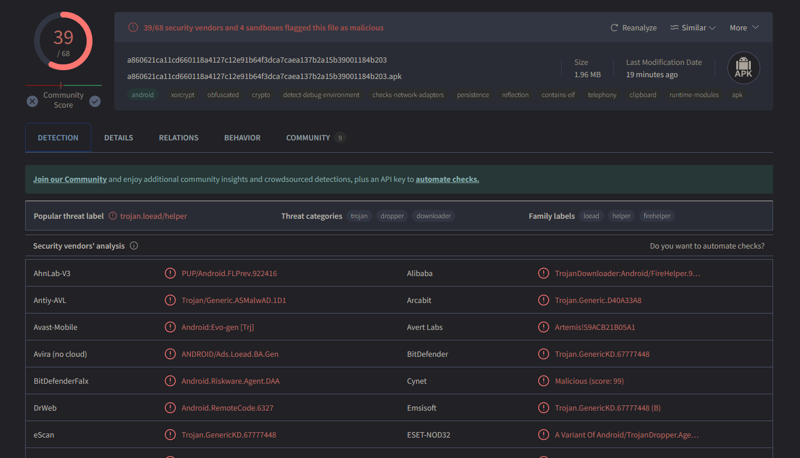

# Malware on Mobile

Malware is malicious software designed to cause harm. Unlike vulnerable software, which may unintentionally cause issues due to configuration or development weaknesses, malware is explicitly created to disrupt, damage, or gain unauthorized access to computer systems. Both result in unwanted, harmful behavior targeting user data, workflows, and devices.

## Types of Mobile Malware

Studying cybersecurity, you need to be aware of various types of malware that can affect mobile devices. Here are some examples:

- **Spyware**: Collects data from a device without the user’s knowledge.
- **Ransomware**: Locks a device or its data and demands a ransom to unlock it.
- **Trojans**: Disguised as legitimate software but perform malicious actions.


## Accessing Malware Samples

For research, analysis, and tool evaluation, you can download malware samples from trusted sources like:

### [**Abuse Bazaar**](https://bazaar.abuse.ch/)
- Abuse Bazaar is a repository of malware samples shared by the security community. 
- It provides a wide range of malware for research purposes. 
- Users can download samples to study the behavior of different types of malware.

### [**VirusTotal**](https://www.virustotal.com/)
- VirusTotal is a popular online service that aggregates antivirus engines and scan results to detect malware. 
- It also offers a repository of malware samples submitted by users.
- Used for files, URLs, and IP addresses.

For mobile-specific malware, resources include:

### [**AndroZoo**](https://androzoo.uni.lu/)
- AndroZoo is a collection of **Android** applications gathered from various sources.

### [**Drebin Dataset**](https://drebin.mlsec.org/)
- The Drebin Dataset is a comprehensive dataset specifically curated for **Android** malware research.

## Tasks

### 1. Download Malware Samples

- Download 3 mobile malware samples, one from each category: Spyware, Ransomware and Trojans, from [*Abuse Bazaar*](https://bazaar.abuse.ch/).
- Download 3 mobile malware samples, one from each category: Spyware, Ransomware and Trojans, from [*AndroZoo*](https://androzoo.uni.lu/api_doc).
- Download 3 mobile malware samples, one from each category: Spyware, Ransomware and Trojans, from [*Drebin Dataset*](https://www.sec.cs.tu-bs.de/~danarp/drebin/download.html).

  #### Instructions on how to use AndroZoo and Drebin Dataset

  #### In **AndroZoo**:
  - **To download an APK whose SHA256 is ${SHA256} using the API key ${APIKEY}**
  You can use one of the following methods in order to download an APK:
  - With Curl (command-line utility on Linux):
    ```bash
    curl -O --remote-header-name -G -d apikey=${APIKEY} -d sha256=${SHA256} \ https://androzoo.uni.lu/api/download
    ```
  - From your Browser (e.g. Firefox, Chrome, Safari, Opera ...):
    ```bash
    https://androzoo.uni.lu/api/download?apikey=${APIKEY}&sha256=${SHA256}
    ```
  - From the az script (thanks to Artsiom Kushniarou contribution): 
    ```bash
    az -n 10 -d 2015-12-11: -s :3000000 -m play.google.com,appchina
    ``` 
The command means: download 10 apks with the dexdate starting from the 2015-12-11 (inclusive), size up to 3000000 bytes (inclusive) and present on either play.google.com or appchina.
  - Where to obtain SHA256s ?
The list of all APKs (with their SHA256) available on AndroZoo can be obtained from the [Lists page](https://androzoo.uni.lu/lists)

  #### In **Drebin Dataset**:
  - In order to download APKs from Drebin Dataset you will need to log in using the following credentials:

    **login: drebin**
    **password: h9FN43vH**

    You can download one of the 6 chunks that contains 1000 APKs.
  - The password for the zip files is "infected".

### 2. Submit Malware Samples to Online Services

Submit downloaded / selected malware samples and submit them to online services to check for malicious behavior and detect them.

#### [**VirusTotal**](https://www.virustotal.com/)

  - **Upload the APK**: Drag and drop the APK file into VirusTotal.
  - **Analyze the Report**: Review the detailed analysis report provided by VirusTotal to understand the detected threats and behaviors of the APK.
    <p align="center">
    
    </p>

### 3. Malware Analysis

  - **Rank the Malware Samples**: Based on the reports from VirusTotal, rank the APKs according to their threat scores.
  - **Identify High-Risk Samples**: Focus on malware samples that exceed a threat score of 60. Identify and document the reasons why these samples are considered highly dangerous. Look for specific behaviors or characteristics that contribute to their high threat level.

### 4. Run the malware on the emulators (Optionaly)
  - **Set Up an Emulator**: Install a new emulator in Android Studio.
  - **Install and Test Malware**: Install the selected malware on the emulator and observe its effects. Document any changes or behaviors that occur on the emulated device.
  - **Compare APKs**: Identify and document the differences in behavior between various APKs. Note specific actions, permissions requested, and any unusual activities that occur.


### Additional resources

#### Additional analyzers:
- [Kaspersky Threat Intelligence Portal — Analysis](https://opentip.kaspersky.com/)
- [VirusShare.com](https://virusshare.com/)
- [Login | Triage](https://tria.ge/)
- [https://analyze.neiki.dev/](https://analyze.neiki.dev/)
- [https://www.capesandbox.com](https://www.capesandbox.com/analysis/451884/)


#### Malware development course:
- [Maldev Academy](https://maldevacademy.com/)

