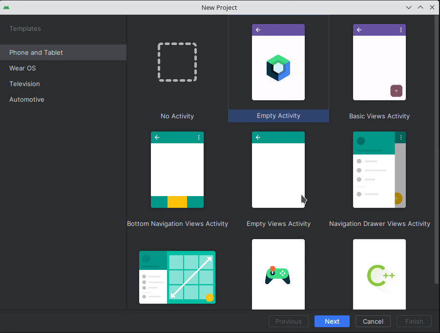
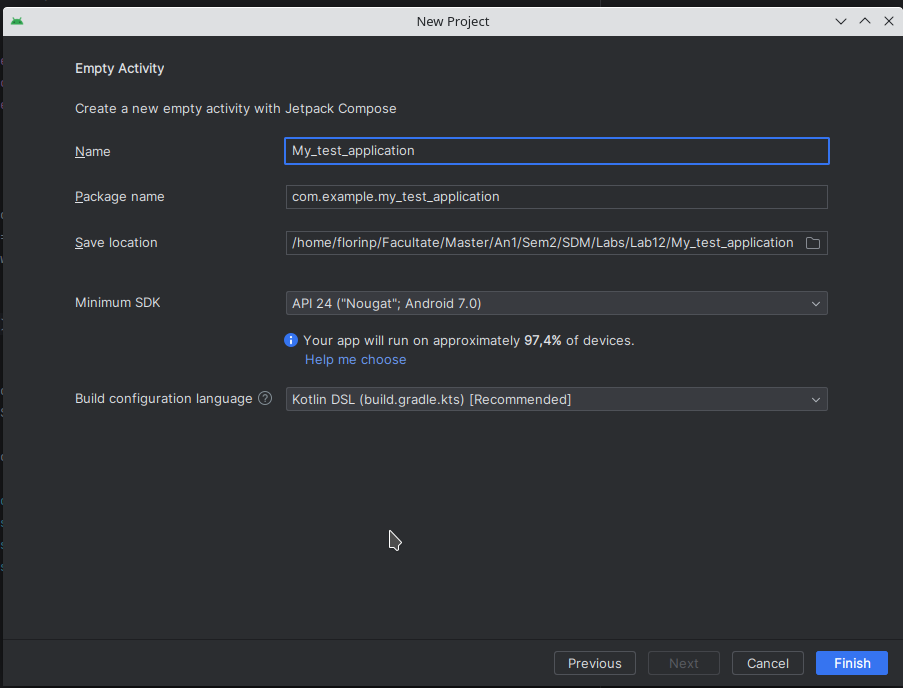
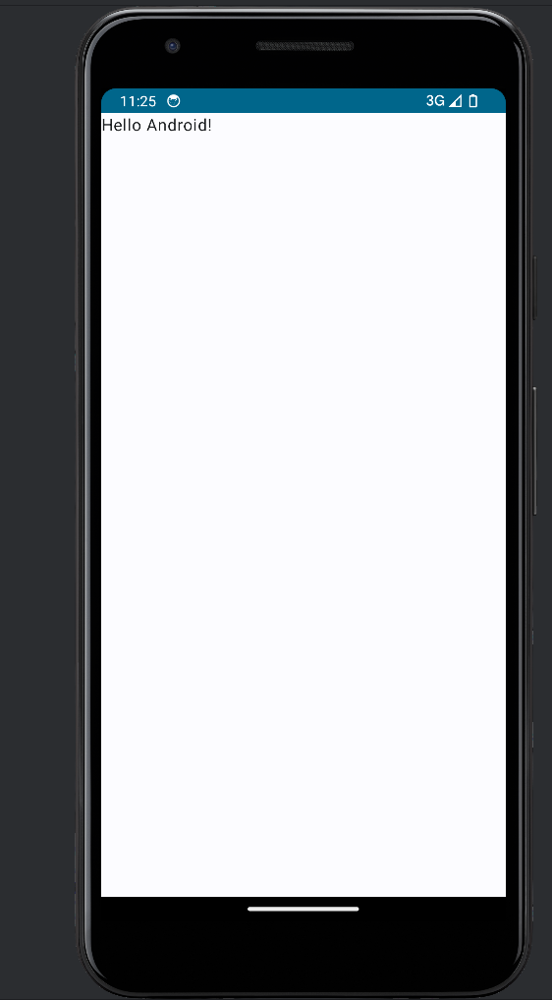
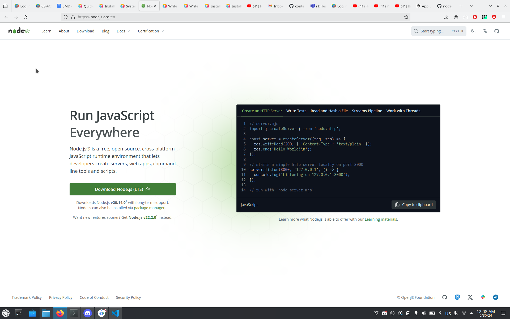
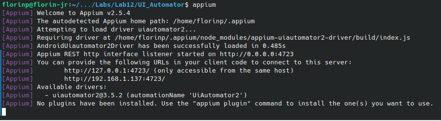

# Mobile UI Security

User interface can be the cause of functionality or security issues. Attackers may provide hidden 
overlapped, small size, difficult to spot UI components that cause the user to lose data or do 
malicious actions. UI security is concerned with providing a safe environment for the user such 
that its actions will not have unintended effects.

One recent example of a pretty interesting UI attack is the Whatsapp GIF attack. You can read more 
about the exploit [here](https://medium.com/@Kevin_Finnerty_Gabagool/major-exploit-alert-gif-based-backdoor-vulnerability-in-android-phones-via-whatsapp-e0330a29db21).

User interface security can be achieved, apart from analysis, via user interface 
testing, or UI exercising. In this case, an application is “exercised” with random events (clicks, 
gestures) being used for activity screens in applications.

UI exercising or testing is useful both for security and robustness of the application, determining 
whether there are user actions that cause the application to malfunction.


## Monkey runner

One of the tools for UI exercising in the mobile (and web world) is Monkey. Monkey is a program 
that runs on your emulator or device and generates pseudo-random streams of user events such as 
clicks, touches, or gestures, as well as a number of system-level events.

When the Monkey runs, it generates events and sends them to the system. It also watches the system 
under test and looks for three conditions, which it treats specially:

- If you have constrained the Monkey to run in one or more specific packages, it watches for 
attempts to navigate to any other packages and blocks them.
- If your application crashes or receives any sort of exception, the Monkey will stop and report 
the error.
- If your application generates an application not responding error, the Monkey will stop and 
report the error.

## TASK

Run Monkey on your Android Emulator using the default application.

### Step 1

In the "New Project" Section select the "Empty Activity" template.

<p align="center">

</p>

### Step 2

Give your project a name, a save location. Select finish in the end. After the gradle finishes the 
build, run the application in the emulator. Great! Now you have an app to play with!

<p align="center">

</p>

### Step 3

Open a shell and start the monkey runner using adb. To test if monkey works run the following command:
`adb shell monkey -p <your package name> -v 500`. The package name is defined in each source of the 
project. In our case the package is called `com.example.my_test_application`.

<p align="center">

</p>

### Observations

When you run this test, you can watch your device or emulator. You will notice random events on UI 
elements are being generated.

<p align="center">
<video src="../media/android-testing-ui-using-application-exerciser-monkey.mp4" width="640" height="480" controls></video>
</p>

When the application crashes, it will stop the exerciser and prints the report on the terminal 
window.

### Bonus

Try running Monkey on a more complex application which can take more input methods.

## Appium

Appium is an open-source tool used for testing mobile applications. It is primarily used to automate the testing of 
mobile applications on various platforms, including iOS and Android. 

Appium can simulate user actions such as taps, swipes, typing, scrolling, and more. It can verify if the application's 
functionalities work as expected, such as navigating between screens, interacting with UI elements, and the 
application's behavior in different non-random scenarios.

## Task

Try running an Appium script on your emulated device.

### Step 1

Visit Node.js github page and download its latest binary.


<p align="center">

</p>

Unarchive it and add the path to the `bin` folder to your `PATH` variable. If you do this correctly, you sholud have also npm installed.

### Step 2

Install appium and its dependencies to run the Appium script on the emulator.

The Appium application is pretty easy to install. Just use this command:
`npm install -g apprium`

In order for Appium to interact with the emulator, we use a driver, which is an interface that allows Appium to automate a partivulat platform.

For this exercise, we will use the `UiAutomator2 Driver`. Appium UiAutomator2 Driver automates native, hybrid and mobile web apps, tested on emulators and real devices. 

Before installing the driver, we need to do two more settings:
 - setup the `ANDROID_HOME` environment variable to point to the directory where the Android SDK is installed (it usually is `~/Android/Sdk/`)
 - setup the `JAVA_HOME` environment variable to point to the JDK home directory (you will need to download a java jdk and link it)

To install the driver, run the following command: `appium driver install uiautomator2`. To check if the install is valid, you can check with the following command: `appium driver doctor uiautomator2`.

After running the commands above you can start the appium server by simply running `appium`. The output below is an usage example.

<p align="center">

</p>

We can also see `UiAutomator2 Driver` as an available driver.

### Step 3

Appium lets you write tests in multiple languages one of them is javascript. To write a test for appium using javascript, let's initialize a new project using `npm init`.

After creating a new project (does not matter what you write in the prompts), install the `webdriver` package used to communicate with the `appium` server. Use the command: `npm i --save-dev webdriverio`. Also, add the following dependency in the `package.json` file.

```js
{
  "devDependencies": {
    "webdriverio": "8.38.0"
  }
}
```

### Step 4
Now it is time to write the test. Create a new file called `test.js` and add the following contents:

```js
const {remote} = require('webdriverio');

const capabilities = {
  platformName: 'Android',
  'appium:automationName': 'UiAutomator2',
  'appium:deviceName': 'Android',
  'appium:appPackage': 'com.android.settings',
  'appium:appActivity': '.Settings',
};

const wdOpts = {
  hostname: process.env.APPIUM_HOST || 'localhost',
  port: parseInt(process.env.APPIUM_PORT, 10) || 4723,
  logLevel: 'info',
  capabilities,
};

async function runTest() {
  const driver = await remote(wdOpts);
  try {
    const batteryItem = await driver.$('//*[@text="Battery"]');
    await batteryItem.click();
  } finally {
    await driver.pause(1000);
    await driver.deleteSession();
  }
}

runTest().catch(console.error);
```

Basically, this code is doing the following:

- Defining a set of "Capabilities" (parameters) to send to the Appium server so Appium knows what kind of thing you want to automate.
- Starting an Appium session on the built-in Android settings app.
- Finding the "Battery" list item and clicking it.
- Pausing for a moment purely for visual effect.
- Ending the Appium session.

Running the script we can see its behaviour:

<p align="center">
<video src="../media/appium_run.mp4" width="1920" height="500" controls></video>
</p>

### Bonus

Try running an Appium script on a real device.
